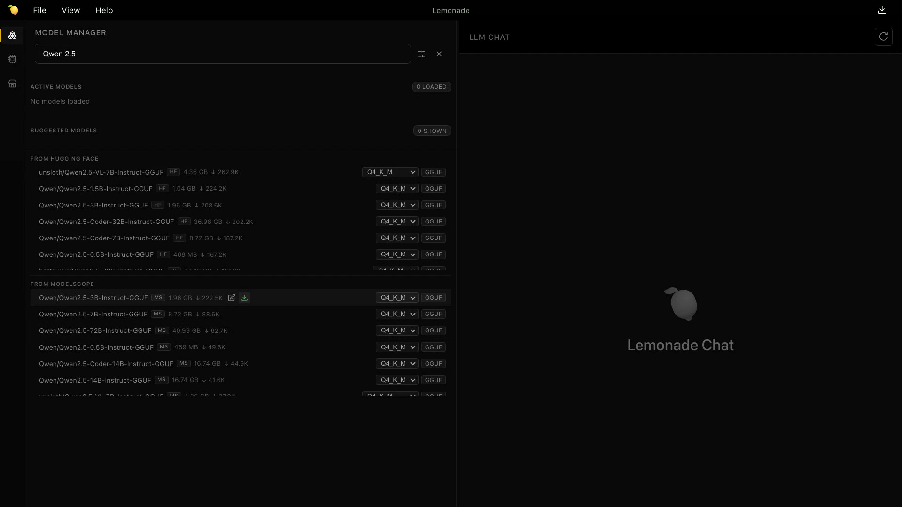
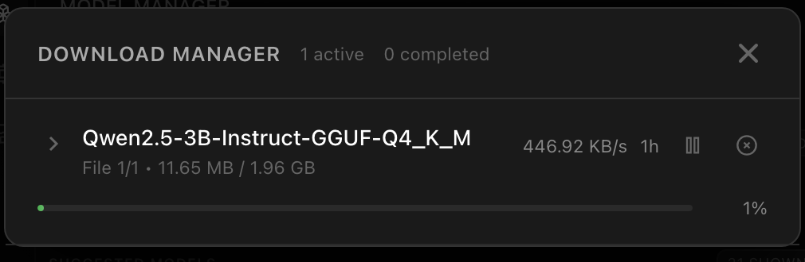
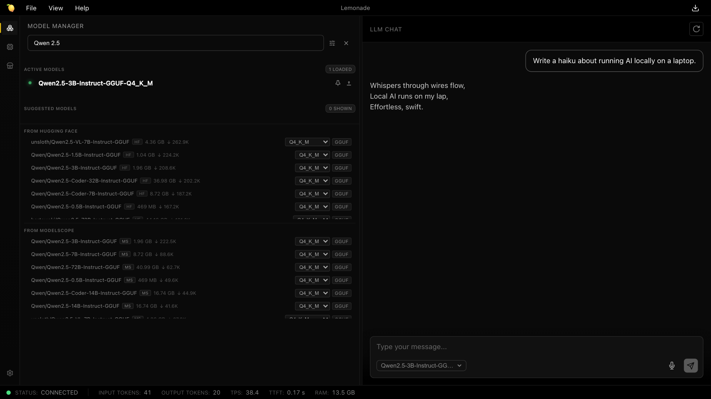

# Search ModelScope from Lemonade

**Date:** July 27, 2026 · **Author:** Lemonade Team

> Lemonade v11.5 adds ModelScope as a second model registry, right next to Hugging Face. Same search box, twice the catalog.

## Twice the catalog, same search box

Starting with v11.5, Lemonade supports [ModelScope](https://modelscope.cn) as a model registry alongside Hugging Face. Search it the same way you search Hugging Face — right from the Model Manager — and download models from whichever registry has what you need. This matters most for users in regions where ModelScope mirrors are significantly faster, and for models that publish to ModelScope first.

There's nothing to set up — no accounts, no extra configuration. Type a name, browse the GGUF variants, and hit download.

And you won't waste a download on a repo that can't run. Before a result earns a download button, Lemonade inspects the repository's actual file tree and only offers models with GGUF files it can serve. What you see is what will run.

## Take it for a spin

Open the Lemonade app (or the web app at `http://localhost:13305/app`) and head to the **Model Manager**. Start typing — `Qwen 2.5`, say. After three characters the search goes live, and two new sections appear below your local models: **FROM HUGGING FACE** and **FROM MODELSCOPE**.



Every result tells you what you're getting before you commit: the repository name, a source badge (**MS** or **HF**), the download size, and how many times the community has pulled it. Want a different quantization? Pick one from the dropdown — Q4_K_M is preselected as a sensible default. Then click download and watch it go.



When the download finishes, the model registers itself and is ready to use — select it in the chat panel, point your favorite OpenAI-compatible client at it, whatever you'd do with any other Lemonade model. Where it came from stops mattering the moment it lands on your disk.



## Prefer a terminal?

The CLI speaks ModelScope too. Give `lemonade pull` a checkpoint and tell it where to look — or just paste a `modelscope.cn` model URL and it figures out the rest.

```bash
lemonade pull Qwen/Qwen2.5-3B-Instruct-GGUF --source modelscope
```

If you're building on top of the server, the same search that powers the Model Manager is one GET away:

```bash
curl "http://localhost:13305/v1/registry/search?source=modelscope&query=qwen"
```

Add `format=gguf` to bias results toward GGUF repositories, or `limit` to control how many come back (1–50, default 12). Responses include tags, task, download counts, and a GGUF hint per model — see the [API docs](https://lemonade-server.ai/docs/api/lemonade/) for the full shape.

## Go find something new

Update to Lemonade v11.5 and search both registries from one box.

[Install Lemonade](https://lemonade-server.ai/#getting-started) · [Join the Discord](https://discord.gg/5xXzkMu8Zk)
